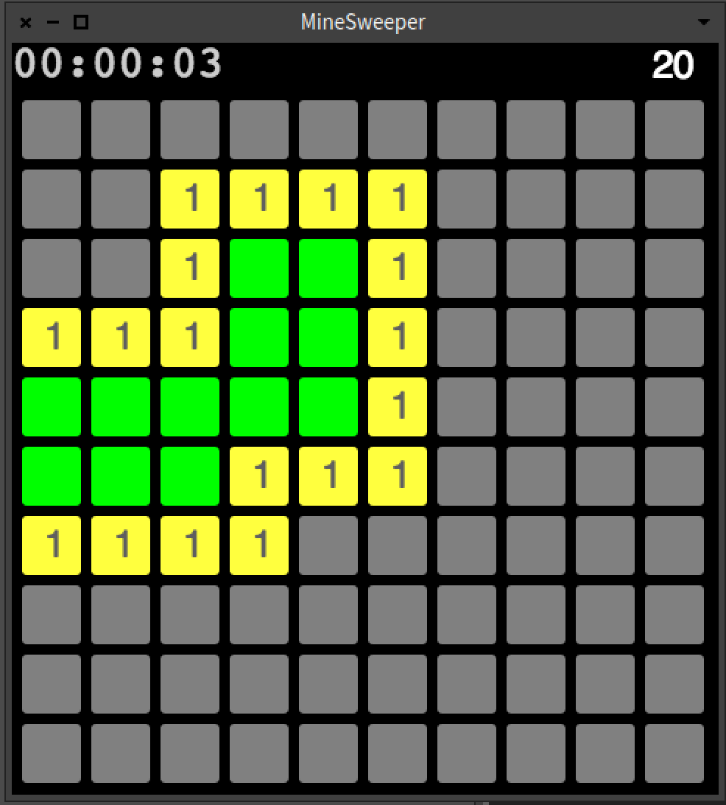

Documentation:                                                                                                                                       
https://docs.google.com/document/d/1SIcJcr92aLJI_XGo7B9qcOxgMl3Uks7gZDiCP_MQJ7E/edit?usp=sharing

##### Main Menu:

##### Options:

##### Game Proccess:

____________________________________________________________

Report:                                                  
We have created several classes for Cell, Grid etc. Separated programm to interface side and data side.               
Connected them throught announcments. 
Implementation of grid is in process.. Say shortly, grid is worked, click is almost implemented.        

Next steps:           
1. Changing animation of cell on click.
2. Implementation of algoritmus: bfs running (setting bombs in right places), best way how to win the player.
3. Continue working with pain(((((

How to execute: (put in the playground)            
|space|
space := ((BlSpace new extent: 400@400) yourself root addChild: MGameElement new)
space show

_________________________________________________
30.11.2017

- Edited structure, extended classes, fixed names:
    - added tags:
        - Elements
        - Model 
        - Events
    - added class variable minesArounf for MModelCell 
- Implemented setNumberOfMines method which finds number of mines surrounding each cell and tells cell this number

_________________________________________________
7.12.2017

- Renamed methods to correctly represent their meaning.                              
- Introduced MBoardModel in order to operate with board in separate class.                
- Added ^self to the most of methods which returned nothing.                            
- Added state of the cell called marked, which represents state, when user marked not opened cell as a bomb.                             
- Added functionality of placing mines with parameter notMineCell, which represents first time clicked cell.    

________________________________________________
25.12.2017

- Implemente opening the mine icon in game.
- Added new icons.
- Implemented timer.
- Improved implementation of placing mines

________________________________________________
01.01.2018

- Implementes mines left counter.
- Implemented game menu with functional buttons:
    - New game;
        - Continue;
        - Settings;
        - Exit game.
- Implemented game settings:
    - Automatical or manual set of:
        - grid size;
        - mines count.
- Implemented dinamyc window's size depends on manually set of parametrs in game's settings.
- Changes in game design.
- Implemented cell marking.
- Implemented game as a singleton.
- Implemented lose game notification.

___________________________________________
04.01.2018

- Implementatin of win game.
- Implemented win game notification.
- Tests
- Implemented cell unmarking.

___________________________________________

  How to execute (new):                                                                                                                                   
  MGameMenu open.

